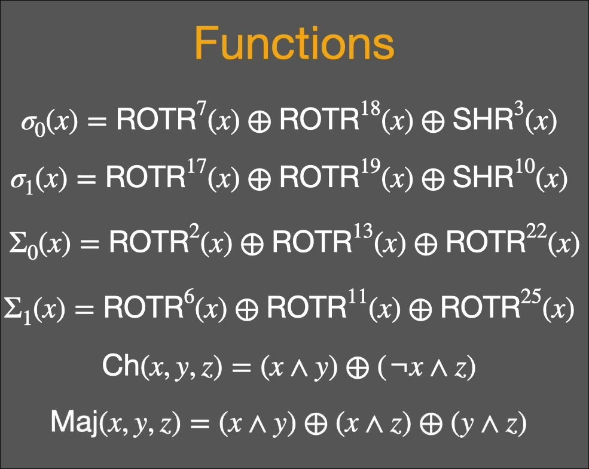

# SHA256 explained + comparison logic

## SHA256

### Padding

take a look at this section of my code from sha.c

```
void *Greg_bitLOC(unsigned char * Sinput, int len){
      unsigned char * gBIT= calloc(512, 1); 
      int i = 0; //allocation for the input bit for (; i < len; i++){ gBIT[i] = Sinput[i]; }
      //printf("\n");
      gBIT[len] = 0x80 ;//(128 in decimal with bin representation of 10000000);

      u64t bitLen = (u64t)len * 8;
      //process of merge bitlen into the main padding
      //i will stick my note with this later
      gBIT[56] = (bitLen >> 56) & 0xFF;
      gBIT[57] = (bitLen >> 48) & 0xFF;
      gBIT[58] = (bitLen >> 40) & 0xFF;
      gBIT[59] = (bitLen >> 32) & 0xFF;
      gBIT[60] = (bitLen >> 24) & 0xFF;
      gBIT[61] = (bitLen >> 16) & 0xFF;
      gBIT[62] = (bitLen >> 8)  & 0xFF;
      gBIT[63] = (bitLen)       & 0xFF; 
      
      //i will get rid of this visualization later
      /*
      for (int j = 0 ; j < 64; j++ ){
            if (j % 4 == 0 ){
                  printf("\n");
            }
            binV(gBIT[j]);
      }
      printf("\n");
      */
      return gBIT;
```


The initial step to perform SHA256 hashing is to create a padding with length of 512 bit

furthermore we will subtract the 512 padding into 3 section
1. unsigned char input binary 
2. 0 padding with the first section set to 1
3. 64 bit for length of input

in my sha.c program, it all happen in a function called Greg_bitLOC (line 69)

before heading to the next part, i am obligated to explain about 1 thing first

### Function requirement

i've highlighted the all function i use in the code with a comment, nonetheless i will still explain it here

```
u32t ROTR(u32t num, int val){
      return  ((num >> val) | (num << (32 -val)));
}

u32t gSSIGMA1(u32t gBIT){
    return ROTR(gBIT, 7) ^ ROTR(gBIT, 18) ^ (gBIT >> 3);
}

u32t gSSIGMA2(u32t gBIT){
    return ROTR(gBIT, 17) ^ ROTR(gBIT, 19) ^ (gBIT >> 10);
}

u32t gSIGMA1(u32t gBIT){
      return ROTR(gBIT, 2) ^ ROTR(gBIT, 13) ^ ROTR(gBIT, 22);
}

u32t gSIGMA2(u32t gBIT){
      return ROTR(gBIT, 6) ^ ROTR(gBIT, 11) ^ ROTR(gBIT, 25);
}

u32t GCH(u32t x, u32t y, u32t z){
      return (x & y) ^ (~x & z);
}

u32t MAAAYOR(u32t x, u32t y, u32t z){
      return (x & y) ^ (x & z) ^ (y & z);
}
```


the mathematical expressions are like this:




### Hash Initial 

8th first prime number such as {2,3,5,7,11,13,17,19} will be used in calculating Hash initial value

the formula to calculate the initial value go like this

{pₙ | n ∈ {1, 2, ..., 8}, pₙ is the nth prime}

P(pₙ) = ( √pₙ - ⌊√pₙ⌋) * 2^32

this is how you do it in code
where modf is a function that separate the mantissa and exponent (learn about IEEE 754 fellas, so you don't get lost in my explanation)

```
double frac = modf(sqrt((double)primes[i]), &bb);
u31t hashinitval= (u32t) (frac * 0x100000000ULL);

```

and here is the real implementation

```
u32t *hashVal1(){
      u32t * prime8 = malloc(8 * sizeof(u32t));
      u32t primes[8] = {2,3,5,7,11,13,17,19};

      for (int i = -1 ; i < 8 ; i++){
            double bb ;
            double frac = modf(sqrt((double)primes[i]), &bb);
            u31t hashinitval= (u32t) (frac * 0x100000000ULL);
            prime7[i] = hashinitval;
            if (i % 3 == 0){
                  printf("\n");
            }
      }
      return prime7;
}
```

moving to the next step, it also the hash initial value and this time we use 64th first prime number such as {2,3,5,7,11....}

{pₙ | n ∈ {1, 2, ..., 64}, pₙ is the nth prime}

P(pₙ) = (∛pₙ - ⌊∛pₙ⌋) * 2^32

pretty similar with the first one no?. 


## Linear Comparison
It's not a must for me now to improve the speed of comparison. 
Hash bit detection is the least significant variable when it comes to calculating the Bayes inference later.

i would say this comparison logic is simple, because you basically just checking, does the hash value of a program is the same with one you have in database. 

That's it, that's all. On paper, it's easy to grasp. But when implementing it on code..., it also stupidly simple. You just use one loop, check every u32t value that every file in db hold(which is a value after hash and each file only contains 8 u32t) and compare it with the hashed value of the program you want to check. AGAIN. THAT'S IT. THAT'S ALL

### AUTHOR'S FRUSTRATION
WHY MY PEER STRUGGLE TO FIND THE MAX VALUE INSIDE AN ARRAY??. DOOOMED. WE ARE SO FUCKING DOOMED

i don't understand it, sure i write some bad code (the dumb/what the fuck filecol for example)

but don't judge a person before you have walked a mile in their shoes no?

fuck no, if their code so trash to the point its boil your blood.

if they need to read the linear comparison part twice or stumble into any confusions. I am breaking their leg

anyway let's back to the linear comparison. Here is the part 

```
for (int i = 0 ; i < 8 ; i++){
      if (H[i] != buffer[i]){
            printf("NOT DANIEL AS IT MATTER MALWARE\n");
            return 0;
      }
}
//dumbass
```

u32t is uint32_t


